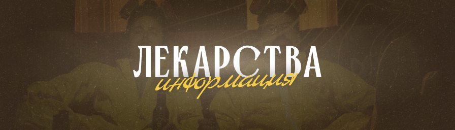

# Информация

<figure><figcaption></figcaption></figure>

<mark style="color:blue;">**Лекарства**</mark> - это механика, позволяющая вам выращивать или синтезировать вещества, которые дают различные баффы и дебаффы. Но будьте осторожны, они приводят к зависимостям!\
Скачать ресурс пак - [https://www.dropbox.com/scl/fi/3efuofuj3bkkbmmd6bzbt/generated-40.zip?rlkey=6ymtdj3sch9bb087a2n52t3vy\&st=haezhe9f\&dl=](https://www.dropbox.com/scl/fi/3efuofuj3bkkbmmd6bzbt/generated-40.zip?rlkey=6ymtdj3sch9bb087a2n52t3vy\&st=haezhe9f\&dl=0)1


<mark style="color:red;">\*\*Дисклеймер\*\*</mark>: мы не пропагандируем употребление наркотиков, мы их сделали ради вашей забавы на проекте . За незаконное приобретение, хранение, перевозку, изготовление, переработку наркотических средств, психотропных веществ или их аналогов предусмотрена уголовная ответственность. <mark style="color:red;">\*\*Статья 228 УК РФ.\*\*</mark> \ Не пробуйте никогда наркотические вещества и производить их, все кто употребляет и имеет зависимость от них не живёт хорошо и счастливо, он либо теряет друзей, семью и своё будущее, либо умирает или оказывается в тюрьме. Хэппи энда в своей жизни после наркотиков вам не ждать.



Мы не поддерживаем, не одобряем и не распространяем информацию о незаконной деятельности в реальном мире. Все рецепты вымышленные. Система лекарств создана по мотивам сериала Breaking Bad


### <mark style="color:blue;">Лекарства</mark>

Ваша статистика и информация по лекарствам можно узнать командой <kbd>/drugs</kbd>\
В профиле можете узнать какие лекарства вы пробовали, зависимости и толератность по ним.

<figure><figcaption></figcaption></figure>

Лекарства делятся на <mark style="color:blue;">**3 категории**</mark> и их подвиды:

* **Натуральные:** _Марихуана, Табак_
* **Полусинтетические:** _Стимуляторы, Опиоидные_
* **Синтетические:** _Стимуляторы, Эйфоретики._

Применение лекарств имеет <mark style="color:blue;">**5 систем**</mark>:

* **Кайф: \[**&#x31;-10] балльная система. Каждое применение дает вам Х количество баллов, которое зависит на получаемые эффекты. Чем больше баллов кайф, тем сильнее эффекты.
* **Зависимость: \[**&#x31;-10] балльная система. Каждое применение дает вам Х количество баллов зависимости. Чем больше баллов - тем чаще ваш персонаж просит лекарство. Если вы игнорируете зависимость, то получаете дебаффы.
* **Толерантность: \[**&#x31;-10] балльная система. Каждое применение дает вам Х количество баллов толерантности. Чем больше баллов - тем меньше эффекты по времени и потребуется дозировка больше, чем обычно.
* **Передозировка:** если вы используете больше, чем обычно, или если вещество было слишком мощным, чем ваша **толерантность**, вы получите дебаффы и словите передозировку.
* **Отхода:** после того, как эффект закончился, к вам придут отхода и дебаффы. Пропадут они если вы примите вещество, либо как закончатся по времени.

### <mark style="color:blue;">Шейдеры</mark>

Так как майнкрафт не позволяет делать свои визуалы, вы можете установить шейдер под ваше лекарство. Мы подобрали несколько шейдеров, которые хорошо подойдут к трипу.


Шейдеры тестились на версии **1.20.1 Optifine**


[Super Ugly Shaders](https://modrinth.com/shader/super-ugly-shaders) - хорошо подойдет под LSD / грибной трип

[Jelly World](https://ru-minecraft.ru/mody-minecraft/shaders/49192-jelly-world-sheyder-dlya-narkomanov-vse-versii.html) - хорошо подойдет под LSD / грибной трип

[Aeon ](https://modrinth.com/shader/aeon/gallery)- просто прикольный шейдер

[Epoch](https://modrinth.com/shader/epoch) - самый лучший шейдер, подходит почти к каждому веществу

[Acid](https://modrinth.com/shader/acidshaders15) - тоже нормальный, но быстро надоест.
