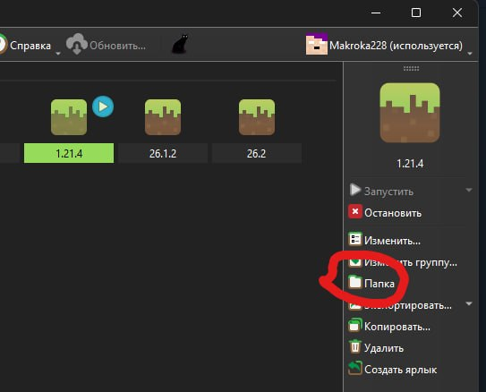
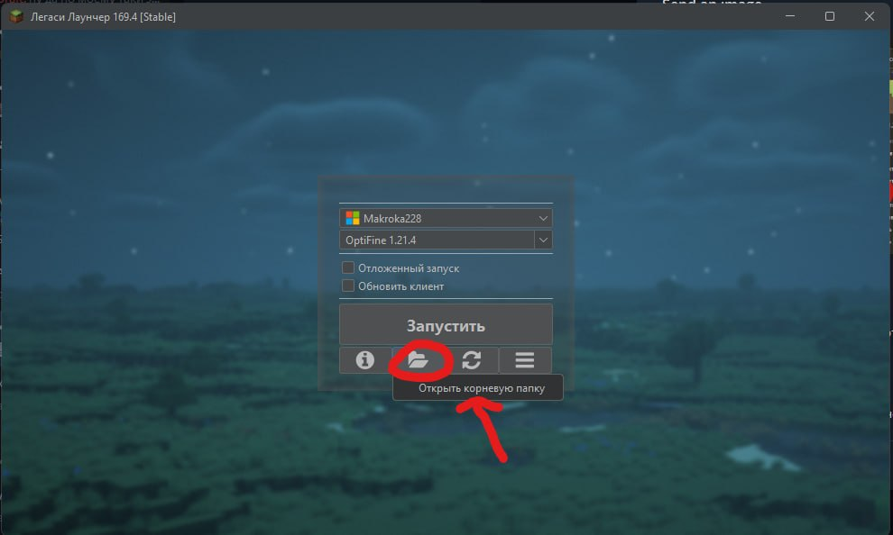
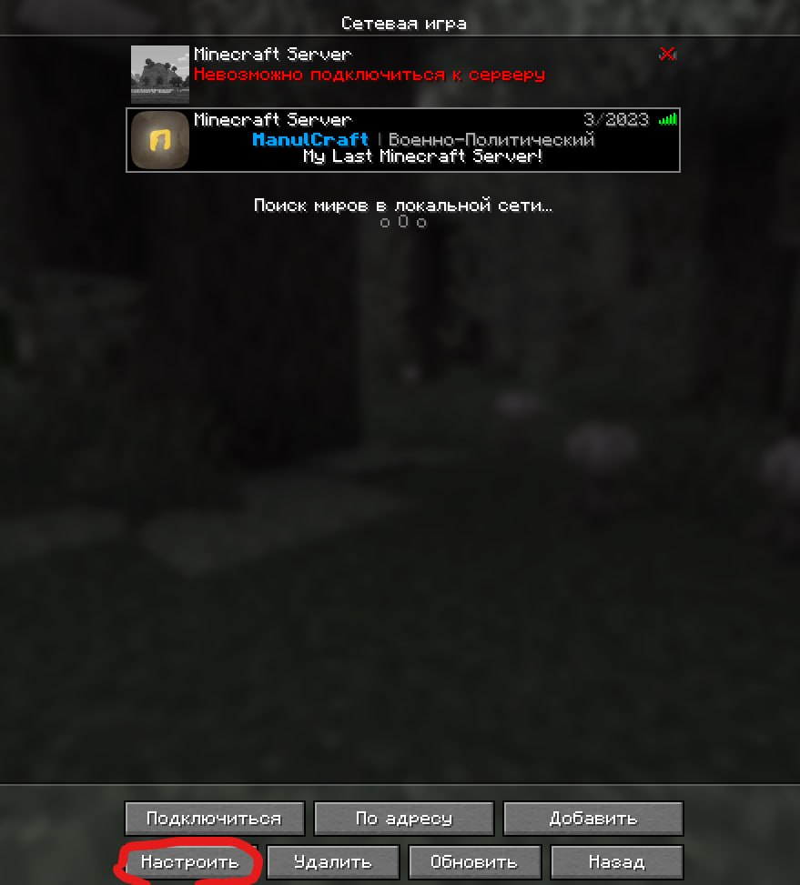
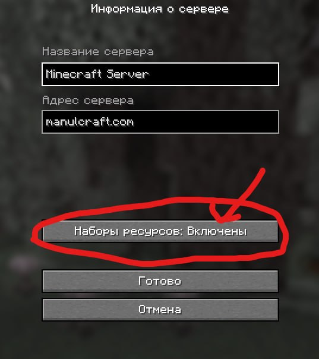

# 💡 Исправить Ресурс Пак

##

<figure><figcaption></figcaption></figure>

## Исправление проблем с ресурс-паком

Если ресурс-пак отображается неправильно, отсутствуют текстуры, появляются чёрные квадраты или не работают кастомные модели — чаще всего проблема связана с отсутствием необходимых модов или неправильной установкой.

Ниже приведены наиболее эффективные способы решения этой проблемы для **Minecraft 1.21.4**.

***

### Способ 1. Fabric + Sodium (рекомендуется)

Для современных версий Minecraft лучшим вариантом является использование **Fabric**. Такая сборка обеспечивает высокую производительность и корректную работу большинства современных ресурс-паков.

Установите следующие моды в папку `mods`:

| Мод                               | Назначение                                                                                                                               |
| --------------------------------- | ---------------------------------------------------------------------------------------------------------------------------------------- |
| **Fabric API**                    | Библиотека, необходимая для работы большинства Fabric-модов.                                                                             |
| **Sodium**                        | Оптимизация игры и повышение производительности.                                                                                         |
| **Indium**                        | Добавляет совместимость Sodium с модами, использующими расширенный рендеринг. Без него некоторые ресурс-паки могут работать некорректно. |
| **CIT Resewn (Reborn)**           | Поддержка кастомных текстур предметов (CIT). Например, изменение внешнего вида предмета после переименования.                            |
| **Entity Model Features (EMF)**   | Добавляет поддержку пользовательских моделей мобов.                                                                                      |
| **Entity Texture Features (ETF)** | Позволяет использовать дополнительные текстуры и эффекты для существ.                                                                    |

> ⚠️ **Важно:** используйте версии модов, соответствующие **Minecraft 1.21.4**. Несовместимые версии могут привести к ошибкам или невозможности запуска игры.

***

### Способ 2. Если используется Forge или NeoForge

Если ваша сборка работает на **Forge** или **NeoForge**, не рекомендуется устанавливать **OptiFine** вместе с большим количеством модов. Это может вызвать конфликты и проблемы с отображением графики.

Вместо этого рекомендуется использовать:

* **Embeddium** — оптимизация, аналогичная Sodium;
* **Forgified Fabric API** — обеспечивает совместимость некоторых Fabric-компонентов;
* **Sinytra Connector** — позволяет запускать отдельные Fabric-моды (например, **CIT Resewn**) в среде Forge.

Если выбор отсутствует — используйте данную связку. Однако для максимальной совместимости с современными ресурс-паками предпочтительнее **Fabric**.

***

## Переустановка серверного ресурс-пака

Если серверный ресурс-пак не загружается или работает некорректно, выполните следующие действия. Данную процедуру необходимо выполнить **только один раз**.

> ⚠️ **Важно:** перед выполнением инструкции полностью закройте Minecraft.

### Переустановка серверного ресурс-пака

**1. Откройте папку игры**

**Prism Launcher**

<figure><figcaption></figcaption></figure>

1. Выберите нужную инстанцию.
2. Нажмите кнопку, указанную на **фото 1**.

**Legacy Launcher**

<figure><figcaption></figcaption></figure>

1. Откройте лаунчер.
2. Нажмите кнопки, указанные на **фото 2**.

**Другие лаунчеры**

1. Нажмите сочетание клавиш **Win + R**.
2. Введите следующую команду:

```
%appdata%\.minecraft
```

3. Нажмите **Enter**.

***

**2. Очистите кэш серверного ресурс-пака**

В открывшейся папке найдите каталог:

```
server-resource-packs
```

Удалите его полностью.

***

**3. Запустите Minecraft**

Запустите игру с одной из следующих конфигураций:

* **OptiFine 1.21.4**
* **Fabric + Iris 1.21.4**

***

**4. Проверьте настройки серверного ресурс-пака**

<div><figure><figcaption></figcaption></figure> <figure><figcaption></figcaption></figure></div>

Перед подключением к серверу убедитесь, что загрузка серверных ресурс-паков включена.

Как это сделать показано на **фото 3** и **фото 4**.

***

### Готово

После выполнения всех действий подключитесь к серверу повторно. Ресурс-пак будет автоматически скачан заново.

> 💡 Если проблема не исчезла, обратитесь к администрации сервера, указав используемый лаунчер, версию Minecraft и приложив скриншот ошибки.

### Если проблема не исчезла

Если после выполнения всех рекомендаций ресурс-пак по-прежнему работает некорректно, обратитесь к администрации сервера и приложите:

* версию Minecraft;
* используемый загрузчик (Fabric, Forge или NeoForge);
* список установленных модов;
* название ресурс-пака;
* скриншот возникшей проблемы.

Обращаться к t.me/manulcraftsupport
